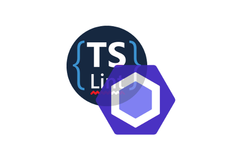

# adidas linter configurations

adidas configurations for the different linting tools for JavaScript, TypeScript, CSS/LESS/SASS, etc.

The purpose of these configurations is to define a set of strict rules to validate the coding standards. The adidas standards are based on the most used by the community with some slight changes.

This repository provides configurations for the different JavaScript language versions, from ES5 (which acts as base configuration) to ES9.

These configurations can be used in any project written in JavaScript or TypeScript, it does not matter whether it is frontend or backend code.

## Use cases

The main use case of this repository and their linter configuration is to check the code quality of the source code of the project.

The linter tools used to check these configurations will display errors if a rule is violated but they never modify the source code unless indicated to do so.

adidas is not responsible for the usage of this software for different purposes that the ones described above.

## Requirements and dependencies

This repository contains different linter configuration which are independent packages. It means that all these packages are published independently but managed all together.

[NodeJS/NPM](https://nodejs.org/) are required to work with the repository.

## Installation and running

- In development mode (dependencies of the main package):
    ```
    npm ci
    ```
- Install a specific package in production mode (installation of each configuration):
    ```
    npm install CONFIGURATION_PACKAGE_NAME[@VERSION]
    ```

The required dependencies of each package are listed in its own `package.json` file as dependency or peer dependency.

Specific instructions about how to run the linter configurations are placed in the `README.md` file of each package.

## FAQ

### Maintainers

Check the contributor list and you will be welcome if you want to contribute.

### Contributing

Check out the [CONTRIBUTING.md](./.github/CONTRIBUTING.md) file to know how to contribute to this project.

### ESLint Peer Dependencies

By default, `eslint` resolves dependencies in the first level of `node_modules` and won't go any deeper.

As a fix for this, we improved the resolution by adding `require.resolve` to each `extends` entry in our configurations so it will look for a nested module instead.

Be aware that currently there is no way to resolve either relative or absolute paths for the `plugins` section of ESLint:

- https://github.com/eslint/eslint/issues/3458
- https://github.com/eslint/eslint/issues/6237

## License and Software Information

© adidas AG

adidas AG publishes this software and accompanied documentation (if any) subject to the terms of the MIT license with the aim of helping the community with our tools and libraries which we think can be also useful for other people. You will find a copy of the MIT license in the root folder of this package. All rights not explicitly granted to you under the MIT license remain the sole and exclusive property of adidas AG.

NOTICE: The software has been designed solely for the purpose of analyzing the code quality by checking the coding guidelines. The software is NOT designed, tested or verified for productive use whatsoever, nor or for any use related to high risk environments, such as health care, highly or fully autonomous driving, power plants, or other critical infrastructures or services.

If you want to contact adidas regarding the software, you can mail us at _software.engineering@adidas.com_.

For further information open the [adidas terms and conditions](https://github.com/adidas/adidas-contribution-guidelines/wiki/Terms-and-conditions) page.

### License

[MIT](LICENSE)
